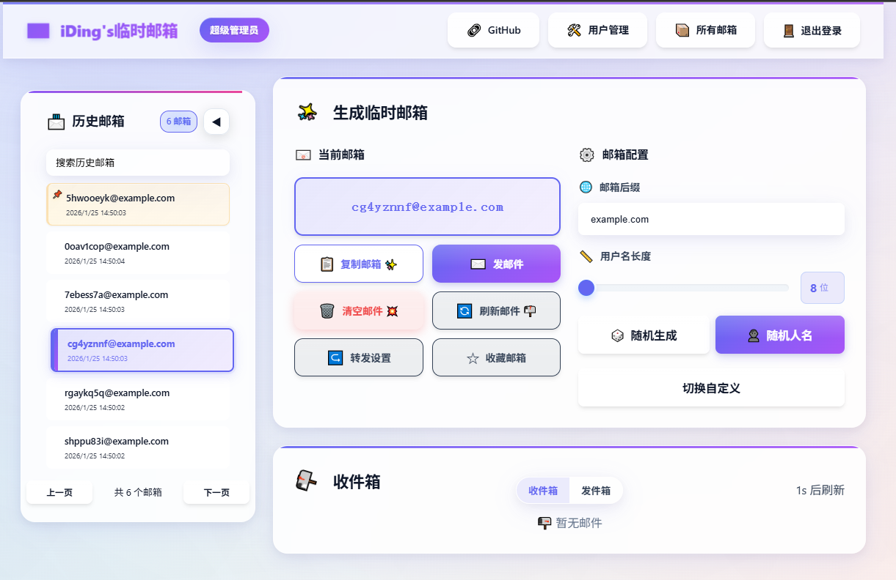
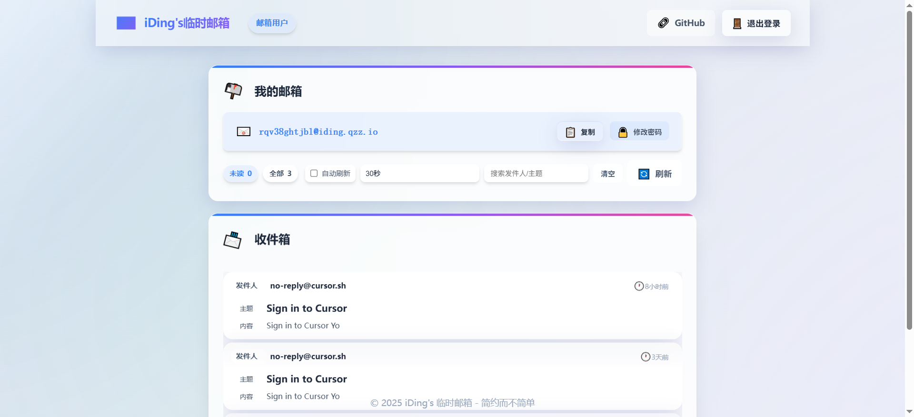

# Freemail - 临时邮箱服务

[](https://deploy.workers.cloudflare.com/?url=https://github.com/smanx/freemail)

> 
> ## 项目说明（R2 → D1）
> - 本项目在原项目基础上将 **R2 存储迁移到 D1 数据库**：无需配置 R2 存储桶，邮件内容直接存储在 D1 的 `messages` 表中；只需配置 D1 数据库即可完成部署。
> 
> - 搜索功能添加支持搜索邮件内容。

一个基于 Cloudflare Workers + D1 构建的**开源临时邮箱服务**，支持邮件接收、发送、转发、用户管理等完整功能。

> **本项目在原 Freemail 项目基础上进行了优化**：将原项目的 R2 存储功能迁移到 D1 数据库，邮件内容直接存储在 D1 中，无需额外配置 R2 存储桶，只需配置 D1 数据库即可完成部署。

**当前版本：V4.8** - 新增单个邮件转发和收藏功能

`转发的地址需要在cloudflare Email Addresses中验证`

📖 **[一键部署指南](docs/yijianbushu.md)** | 📬 **[Resend 发件配置](docs/resend.md)** | 📚 **[API 文档](docs/api.md)**

## 📸 项目展示
### 体验地址： https://mailexhibit.dinging.top/

### 体验账号： guest
### 体验密码： admin
### 页面展示

#### 登陆

#### 首页


### 手机端生成与历史
<div style="display: flex; gap: 20px; justify-content: center; margin: 20px 0;">
  
  
</div>

### 单个邮箱页



### 全部邮箱预览


#### [更多展示点击查看](docs/zhanshi.md)

## 功能特性

| 类别 | 特性 |
|------|------|
| 📧 **邮箱管理** | 随机生成临时邮箱 · 多域名支持 · 置顶/收藏 · 历史记录 · 邮箱搜索（支持搜索邮件内容） |
| 💌 **邮件功能** | 实时接收 · 自动刷新 · 验证码智能提取 · HTML/纯文本 · 邮件转发 |
| ✉️ **发件支持** | Resend API 集成 · 多域名密钥 · 批量发送 · 定时发送 · 发件记录 |
| 👥 **用户管理** | 三层权限模型 · 用户/邮箱分配 · 邮箱单点登录 · 登录权限控制 |
| 🎨 **现代界面** | 毛玻璃效果 · 响应式设计 · 移动端适配 · 列表/卡片视图 |
| ⚡ **技术架构** | Cloudflare Workers · D1 数据库 · Email Routing |

> 💡 邮箱用户自行修改密码功能默认关闭，如需开启请将 `mailbox.html` 第 77-80 行取消注释。

## 版本历史

<details>
<summary><strong>V4.8</strong>（当前版本）- 邮件转发和收藏</summary>

- 邮箱管理页面支持按转发/收藏状态筛选
- 支持将指定邮箱转发到目标邮箱
- 批量前缀转发可通过 `FORWARD_RULES` 环境变量配置
</details>

<details>
<summary><strong>V4.5</strong> - 多域名发送配置</summary>

- 支持为不同域名配置不同的 Resend API 密钥
- 支持键值对、JSON、单密钥三种配置格式
- 系统根据发件人域名自动选择 API 密钥
</details>

<details>
<summary><strong>V4.0</strong> - 邮箱登录与全局管理</summary>

- 支持邮箱地址单点登录
- 全局邮箱管理功能，可限制单个邮箱登录
- 邮箱搜索、随机人名生成、列表/卡片视图切换
</details>

<details>
<summary><strong>V3.x</strong> - 用户管理与性能优化</summary>

- V3.5：数据库查询优化、邮件 EML 存储、移动端适配
- V3.0：三层权限模型、用户管理后台、前端权限防护
</details>

<details>
<summary><strong>V1.x ~ V2.x</strong> - 基础功能</summary>

- V2.0：Resend 发件集成、邮箱置顶
- V1.0：邮箱生成、邮件接收、验证码提取
</details>

## 部署配置

### 快速开始

1. **一键部署**：点击顶部按钮，按照 [部署指南](docs/yijianbushu.md) 完成配置
2. **配置邮件路由**（收件必需）：域名 → Email Routing → Catch-all → 绑定 Worker
3. **配置发件**（可选）：参考 [Resend 配置教程](docs/resend.md)

> 使用 Git 集成部署时，请在 Workers → Settings → Variables 中手动配置环境变量

### 环境变量

| 变量名 | 说明 | 必需 |
|--------|------|------|
| TEMP_MAIL_DB | D1 数据库绑定 | 是 |
| MAIL_DOMAIN | 邮箱域名，多个用逗号分隔 | 是 |
| ADMIN_PASSWORD | 严格管理员密码 | 是 |
| ADMIN_NAME | 严格管理员用户名（默认 `admin`） | 否 |
| JWT_TOKEN | JWT 签名密钥 | 是 |
| SESSION_EXPIRE_DAYS | 会话过期时间（单位：天，默认7天） | 否 |
| RESEND_API_KEY | Resend 发件密钥，支持多域名配置 | 否 |
| FORWARD_RULES | 邮件转发规则 | 否 |

> **注意**：本项目已将 R2 存储迁移到 D1 数据库，无需配置 R2 存储桶，邮件内容直接存储在 D1 的 `messages` 表中。

<details>
<summary><strong>RESEND_API_KEY 配置格式</strong></summary>

```bash
# 单密钥（向后兼容）
RESEND_API_KEY="re_xxxxxxxxxxxxxxxxxxxxxxxx"

# 键值对格式（推荐）
RESEND_API_KEY="domain1.com=re_key1,domain2.com=re_key2"

# JSON格式
RESEND_API_KEY='{"domain1.com":"re_key1","domain2.com":"re_key2"}'
```

系统会根据发件人域名自动选择对应的 API 密钥。
</details>

<details>
<summary><strong>FORWARD_RULES 配置格式</strong></summary>

规则按前缀匹配，`*` 为兜底规则。

⚠️ **重要**：转发目标邮箱必须在 Cloudflare 控制台中验证后才能使用：
1. 进入 Cloudflare 控制台 → 域名 → 电子邮件 → 电子邮件路由
2. 切换到「目标地址」选项卡
3. 点击「添加目标地址」，输入转发目标邮箱
4. 前往目标邮箱收取验证邮件并点击确认链接


```bash
# 键值对格式
FORWARD_RULES="vip=a@example.com,news=b@example.com,*=fallback@example.com"

# JSON格式
FORWARD_RULES='[{"prefix":"vip","email":"a@example.com"},{"prefix":"*","email":"fallback@example.com"}]'

# 禁用转发
FORWARD_RULES="" 或 "disabled" 或 "none"
```
</details>

## 故障排除

<details>
<summary><strong>常见问题</strong></summary>

1. **邮件接收不到**：检查 Email Routing 配置、MX 记录、MAIL_DOMAIN 变量
2. **数据库连接错误**：确认 D1 绑定名为 `TEMP_MAIL_DB`，检查 database_id
3. **登录问题**：确认 ADMIN_PASSWORD 和 JWT_TOKEN 已设置，清除浏览器缓存
4. **界面显示异常**：检查静态资源路径，查看浏览器控制台错误
</details>

<details>
<summary><strong>调试技巧</strong></summary>

```bash
# 本地调试
wrangler dev

# 查看实时日志
wrangler tail

# 检查数据库
wrangler d1 execute TEMP_MAIL_DB --command "SELECT * FROM mailboxes LIMIT 10"

# 部署
npx wrangler deploy
```
</details>

## 注意事项

- **静态资源缓存**：更新后在 Cloudflare 控制台 Purge Everything，浏览器强制刷新
- **D1 费用**：有免费额度限制，建议定期清理过期邮件
- **安全**：生产环境务必修改默认的 `ADMIN_PASSWORD` 和 `JWT_TOKEN`
- **数据迁移**：如果是升级部署，需执行 `ALTER TABLE messages ADD COLUMN eml_content TEXT` 添加 EML 内容字段

## Star History

[](https://www.star-history.com/#smanx/freemail&Date)

## 联系方式

- 微信：`iYear1213`

## Buy me a coffee

如果你觉得本项目对你有帮助，欢迎赞赏支持：

<!-- <p align="left">
  
  
</p> -->

## 许可证

Apache-2.0 license
